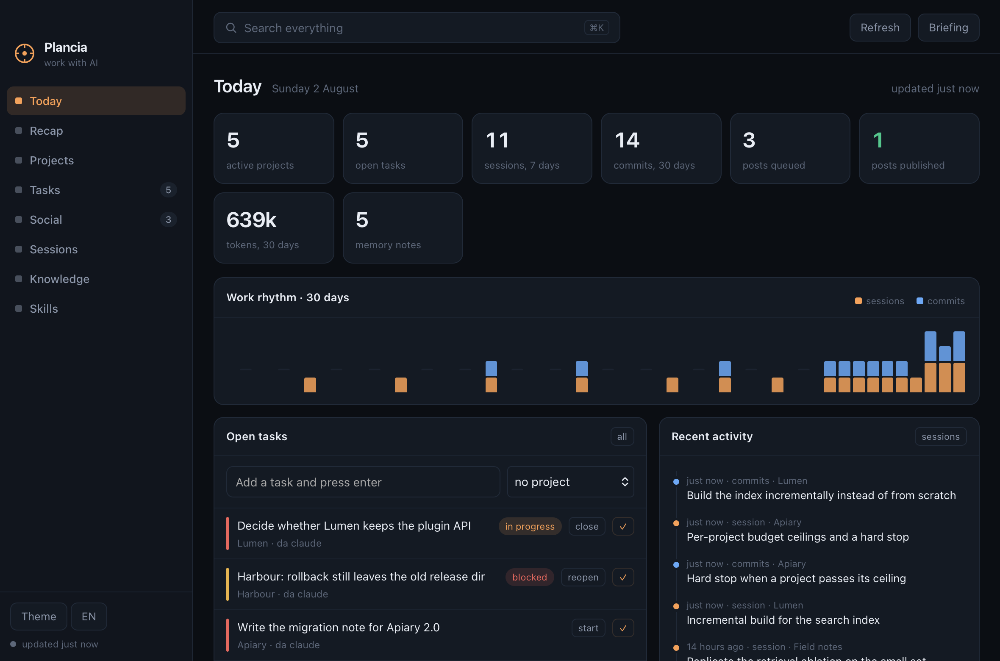
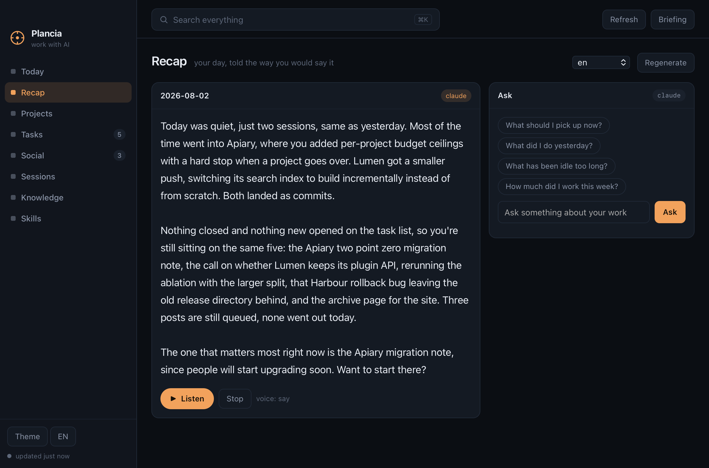
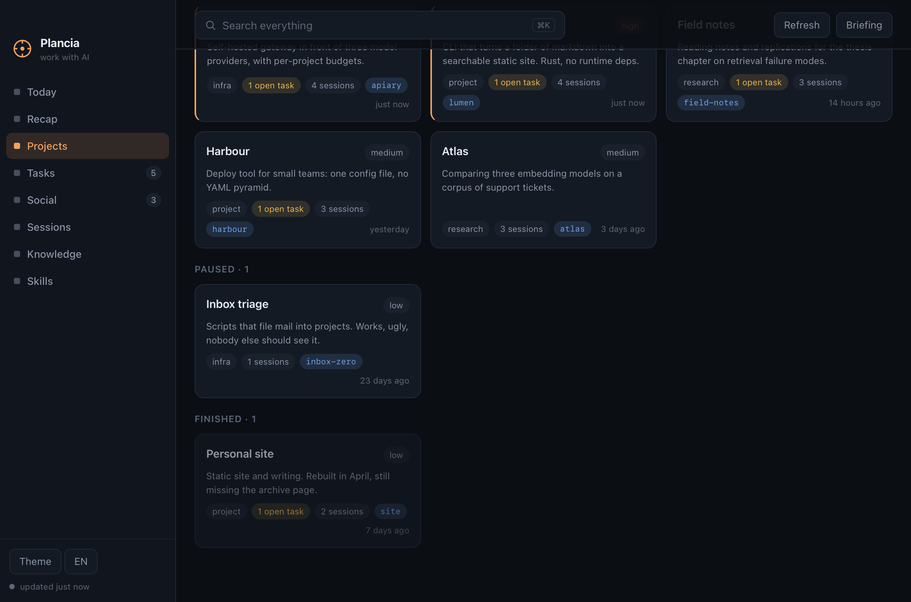

# Plancia

La plancia di comando del lavoro che fai con l'IA. Legge quello che è già
successo dentro Claude Code, lo tiene in un posto solo e lo restituisce in due
modi: un'app macOS nativa per te, un server MCP e un briefing automatico per
Claude.

E ti racconta com'è andata la giornata, ad alta voce, nella tua lingua.

Tutto in locale. Niente esce dalla macchina. Nessuna dipendenza da installare:
Python 3 con la sua libreria standard, Swift per l'app.

[English](README.md)



## Cosa raccoglie

| fonte | dove | cosa ne ricava |
|---|---|---|
| sessioni di Claude Code | `~/.claude/projects/**/*.jsonl` | data, progetto, primo messaggio, scambi, tool, token |
| memoria di Claude | `~/.claude/projects/*/memory/*.md` | descrizione dei progetti, collegamenti `[[wiki]]` |
| skill, plugin, routine | `~/.claude/skills`, `plugins`, `scheduled-tasks` | cosa sa fare il tuo Claude Code |
| GitHub | `gh repo list`, commit recenti | repo, commit, materiale vero per i post |
| git locale | le tue cartelle di codice | branch, modifiche non committate |
| hook di sessione | `SessionStart`, `SessionEnd` | quali sessioni sono aperte adesso |

Le fonti non vengono mai modificate. Plancia le legge e sta da parte.

## Installazione

```bash
cd ~/dev/plancia
./bin/plancia install      # comando, server MCP, hook, skill, avvio automatico
./bin/plancia init         # costruisce la mappa dei progetti dai tuoi dati
./mac/build.sh --install   # costruisce Plancia.app in /Applications
```

`plancia uninstall` rimette tutto com'era. I dati restano in `~/.plancia/`.

## Le tre porte

**L'app.** Finestra nativa, voce nella barra dei menu, e tiene su il backend da
sola. `plancia://recap`, `plancia://ask?q=…`, `plancia://open?view=progetti`,
`plancia://screenshot` sono azioni da legare a una scorciatoia di sistema, a
Raycast o a Comandi rapidi.

**Claude Code.** Sedici tool `plancia_*` in ogni sessione, un hook `SessionStart`
che passa a Claude il tuo stato attuale come contesto iniziale, e due skill che
gli dicono quando leggere da Plancia e quando scriverci.

**Il terminale.** `plancia recap --speak`, `plancia ask "cosa ho spedito questa
settimana?"`, `plancia task add`, `plancia search`, `plancia projects`.

## Il riepilogo giornaliero



Plancia mette insieme la giornata dai dati veri (sessioni, commit, task aperti e
chiusi, post, cosa aspetta ogni progetto) e ne fa un testo scritto per essere
ascoltato: frasi corte, niente elenchi, niente markdown, niente percorsi di file
letti a voce.

Due motori per il testo. Quello a modelli è deterministico, non costa niente e
funziona sempre. L'altro passa gli stessi dati a Claude Code in modalità non
interattiva (`claude -p`) e restituisce una versione raccontata meglio in otto
secondi circa. Se Claude non risponde in tempo si usa il primo e non te ne
accorgi.

Due motori per la voce. [Voicebox](https://github.com/jamiepine/voicebox) se il
suo backend locale risponde, così esce la tua voce clonata. Altrimenti le voci di
sistema di macOS, che ci sono sempre, non chiedono niente e partono subito. Tutte
e due reggono italiano, inglese, spagnolo, francese, tedesco e portoghese.

```bash
plancia recap --speak            # oggi, ad alta voce
plancia recap --lang en          # in inglese
plancia ask "dove ero rimasto con la pipeline di trascrizione?" --speak
plancia daily on 08:45           # ogni mattina, come notifica
plancia daily on 08:45 --voce    # ogni mattina, letto
```

Le domande passano da Claude Code con il contesto di Plancia già allegato, quindi
la risposta sta su quello che è successo davvero e non su un'ipotesi.

## Progetti



Un progetto è quello che dici tu: un repo, una cartella, un file di memoria, o
tutti e tre. `plancia init` propone una mappa da quello che trova, tu la correggi
in `~/.plancia/seed.json`. Le sessioni aperte da una cartella generica vengono
attribuite per parole chiave, e riattribuite a ogni sync man mano che affini le
parole.

## Due scelte non ovvie

**I transcript si leggono a byte, non a righe.** Sono centinaia di megabyte e
crescono. Plancia tiene l'offset di ogni file e rilegge solo la coda nuova; le
righe sopra 256 KB (i risultati dei tool) non vengono mai parsate, solo sondate.
Una rilettura completa di 60 sessioni costa sette secondi.

**Il tipo di un record si cerca per intero.** Dentro `message.content` ci sono
altri campi `type` (`text`, `tool_use`, `tool_result`) che vengono prima di quello
vero: cercare `"type":"` dà la risposta sbagliata. Plancia cerca
`"type":"assistant"` e `"type":"user"` per esteso.

## Struttura

```
bin/plancia            comando
bin/plancia-mcp        server MCP (stdio)
bin/plancia-hook       hook di sessione, 20 ms
plancia/store.py       schema e accesso ai dati
plancia/ingest.py      lettura delle fonti
plancia/recap.py       il riepilogo
plancia/voice.py       sintesi, riproduzione, ascolto
plancia/briefing.py    quello che vede Claude
plancia/actions.py     le scritture, condivise fra HTTP e MCP
plancia/api.py         server locale e REST
plancia/mcp.py         JSON-RPC su stdio
mac/Sources/main.swift l'app macOS
web/                   dashboard, nessun framework, nessun build
```

Dati in `~/.plancia/`: `plancia.db` (SQLite), `seed.json`, `token`,
`briefing.md`, `audio/`. Tienili fuori da qualsiasi cartella sincronizzata: un
file SQLite dentro Drive o Dropbox si corrompe.

## Cosa serve

macOS 13 o più recente, Python 3.9+, Claude Code. Gli strumenti da riga di
comando di Xcode solo per costruire l'app. `gh` è facoltativo e serve solo a
leggere i tuoi repo.

## Sicurezza

Il server ascolta solo su loopback. Le scritture via HTTP chiedono il token in
`~/.plancia/token`, che la dashboard riceve dal server dentro la pagina. Le
letture sono libere: sono dati tuoi, già sul tuo disco.

## Licenza

MIT. Vedi [LICENSE](LICENSE).
