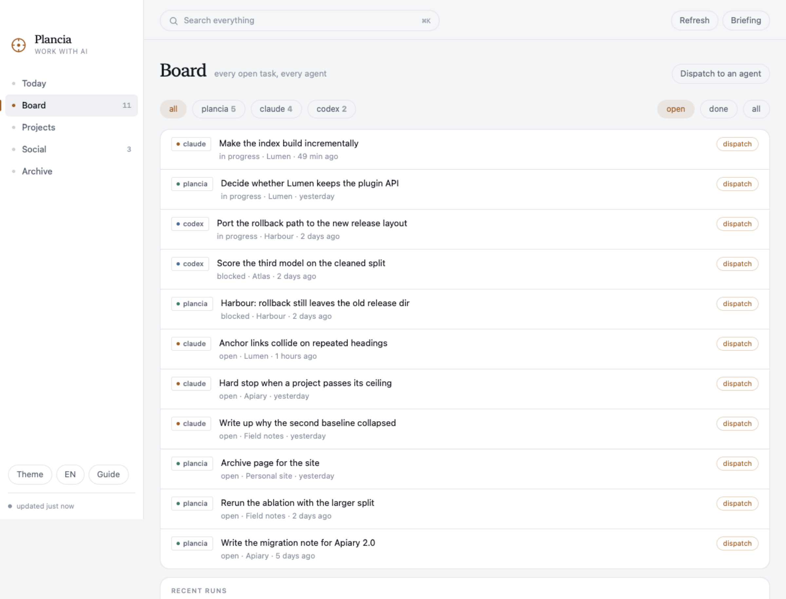

# Plancia

Una lavagna sola per il lavoro che fai con l'IA. Claude Code e Codex si scrivono
già tutto, in file sul tuo disco. Solo che non li legge nessuno insieme. Plancia
sì: tutti i task aperti di tutti e due su una lavagna sola, un riepilogo parlato
della giornata che finisce con la cosa che conviene fare, e un posto solo da cui
rimandare il lavoro.

Sito: [plancia](https://eugenionerelli.github.io/plancia/).

Tutto in locale. Niente esce dalla macchina. Nessuna dipendenza da installare:
Python 3 con la sua libreria standard, Swift per l'app.

[English](README.md)


## Cosa raccoglie

| fonte | dove | cosa ne ricava |
|---|---|---|
| sessioni di Claude Code | `~/.claude/projects/**/*.jsonl` | data, progetto, primo messaggio, scambi, tool, token |
| memoria di Claude | `~/.claude/projects/*/memory/*.md` | descrizione dei progetti, collegamenti `[[wiki]]` |
| skill, plugin, routine | `~/.claude/skills`, `plugins`, `scheduled-tasks` | cosa sa fare il tuo Claude Code |
| GitHub | `gh repo list`, commit recenti | repo, commit, materiale vero per i post |
| git locale | le tue cartelle di codice | branch, modifiche non committate |
| sessioni e obiettivi di Codex | `~/.codex/sessions`, `goals_1.sqlite` | gli stessi, più su cosa Codex si è bloccato |
| liste di task di Claude Code | `~/.claude/tasks/<sessione>/*.json` | cosa è aperto adesso, sessione per sessione |
| hook di sessione | `SessionStart`, `SessionEnd` | quali sessioni sono aperte adesso |

Le fonti non vengono mai modificate. Plancia le legge e sta da parte.

Cosa è cambiato di recente e perché: [docs/NOVITA.md](docs/NOVITA.md).

## Installazione

```bash
cd ~/dev/plancia
./bin/plancia install      # comando, server MCP, hook, skill, avvio automatico
./bin/plancia init         # costruisce la mappa dei progetti dai tuoi dati
./mac/build.sh --install   # costruisce Plancia.app in /Applications
```

`plancia uninstall` rimette tutto com'era. I dati restano in `~/.plancia/`.

## Le tre porte

**L'app.** Finestra nativa, voce nella barra dei menu, e tiene su il backend da
sola. `plancia://recap`, `plancia://jarvis`, `plancia://ask?q=…`, `plancia://open?view=progetti` e
`plancia://pdf` sono azioni da legare a una scorciatoia di sistema, a
Raycast o a Comandi rapidi.

**Claude Code e Codex.** Sedici tool `plancia_*` in ogni sessione di tutti e due, un hook `SessionStart`
che passa a Claude il tuo stato attuale come contesto iniziale, e due skill che
gli dicono quando leggere da Plancia e quando scriverci.

**Il terminale.** `plancia recap --speak`, `plancia ask "cosa ho spedito questa
settimana?"`, `plancia task add`, `plancia search`, `plancia projects`.

## Il riepilogo giornaliero

Plancia mette insieme la giornata dai dati veri (sessioni, commit, task aperti e
chiusi, post, cosa aspetta ogni progetto) e ne fa un testo scritto per essere
ascoltato: frasi corte, niente elenchi, niente markdown, niente percorsi di file
letti a voce.

Due motori per il testo. Quello a modelli è deterministico, non costa niente e
funziona sempre. L'altro passa gli stessi dati a Claude Code in modalità non
interattiva (`claude -p`) e restituisce una versione raccontata meglio in otto
secondi circa. Se Claude non risponde in tempo si usa il primo e non te ne
accorgi.

Due motori per la voce. [Voicebox](https://github.com/jamiepine/voicebox) se il
suo backend locale risponde, così esce la tua voce clonata. Altrimenti le voci di
sistema di macOS, che ci sono sempre, non chiedono niente e partono subito. Tutte
e due reggono italiano, inglese, spagnolo, francese, tedesco e portoghese.

```bash
plancia recap --speak            # oggi, ad alta voce
plancia recap --lang en          # in inglese
plancia ask "dove ero rimasto con la pipeline di trascrizione?" --speak
plancia daily on 08:45           # ogni mattina, come notifica
plancia daily on 08:45 --voce    # ogni mattina, letto
```

Le domande passano da Claude Code con il contesto di Plancia già allegato, quindi
la risposta sta su quello che è successo davvero e non su un'ipotesi.

### E finisce con una decisione

Il riepilogo non si ferma ai fatti. Plancia cerca i segnali nei dati e li
trasforma in proposte, ognuna con un'azione già pronta: un lancio fallito da
riprovare, un obiettivo di Codex senza quota, file non committati da ieri, un
post approvato e mai uscito, un progetto il cui prossimo passo dichiarato è
rimasto lì. Le proposte nascono solo dai segnali, mai dall'intuizione di un
modello, così una giornata tranquilla ti dà un riepilogo corto invece di un
consiglio inventato. Dici "fallo", o "la seconda", e parte.

## Jarvis

Non tieni premuto niente. `⌥Spazio` da qualsiasi app, oppure `plancia://jarvis`,
apre un pannello che ascolta di continuo e capisce dal silenzio che hai finito di
parlare, non da un tasto tenuto giù.

Quello che sente prende due strade. Le frasi che riconosce con certezza (apri una
vista, segna un task, chiudilo, rileggi le fonti, leggimi il riepilogo) partono in
un decimo di secondo, in locale. Tutto il resto va a Claude Code in modalità non
interattiva con i tool `plancia_*` aperti, quindi il task lo aggiunge davvero, il
progetto lo aggiorna davvero, l'archivio lo cerca davvero.

Il microfono resta aperto anche mentre risponde, quindi lo puoi interrompere
ricominciando a parlare. È la cancellazione dell'eco sul nodo di ingresso a
renderlo possibile: senza, si sente da solo e si interrompe da solo. "Annulla"
ferma un lavoro partito, "basta" chiude il pannello. Quando un lancio finisce te
lo dice a voce anche se nel frattempo stavi facendo altro.

```bash
plancia jarvis "ricordami di scrivere la nota di migrazione"   # lo stesso, scritto
```

Claude Code ha la voce [da marzo 2026](https://claudefa.st/blog/guide/mechanics/voice-mode):
tieni premuta la barra spaziatrice e detti. È solo dettatura in ingresso, e una
modalità a mani libere non c'è per scelta. Questa è l'altra metà: risponde e
agisce.

## La lavagna



Claude Code tiene la sua lista di task in una cartella, Codex i suoi obiettivi in
un altro database, Plancia ha i suoi. Nessuno dei tre sa degli altri due. La
lavagna li legge tutti, riporta gli stati a `aperto`, `in corso`, `bloccato`,
`fatto`, `sparito`, e mostra una lista sola.

Da ogni riga puoi scrivere come vuoi che sia fatto il lavoro e mandarlo:

```bash
plancia lavagna                          # la lavagna, da terminale
plancia manda "rilancia l'ablation" --agente codex --progetto atlas
plancia lanci                            # com'è andata
```

Il modo predefinito è `proposta`: l'agente legge e riferisce senza toccare un
file. `--modo esegui` lo lascia scrivere, ed è una scelta che fai ogni volta. Di
ogni lancio restano esito, token e costo.

## Il registro degli eventi

Gli altri strumenti non devono stare a interrogare un database per sapere che è
successo qualcosa. Ogni evento che conta finisce in coda a
`~/.plancia/eventi.jsonl`, una riga JSON, schema `plancia.evento/1`:

```json
{"schema":"plancia.evento/1","id":"9f2c…","ts":"2026-08-02T09:14:22Z",
 "tipo":"lavoro.completato","titolo":"Rilancia l'ablation","progetto":"atlas",
 "origine":"cantiere","dati":{"agente":"codex","modo":"esegui","token":22800}}
```

Tipi: `lavoro.avviato|completato|fallito`, `task.creato|chiuso`,
`post.pubblicato`, `progetto.archiviato|aggiornato`, `riepilogo.pronto`. Chi
legge tiene l'id dell'ultimo evento visto e chiede quello che è venuto dopo, con
`plancia eventi --dopo <id>` o `GET /api/eventi`. Il file si scrive solo in coda
e ruota a 5 MB.

## Due agenti, un archivio solo

Plancia legge le sessioni di Codex da `~/.codex/sessions` insieme a quelle di
Claude Code, e registra il proprio server MCP dentro `~/.codex/config.toml`. I due
agenti vedono gli stessi progetti, gli stessi task, gli stessi venti tool. La
sezione Agenti dell'Archivio mostra chi ha lavorato su cosa e quando si sono
passati il lavoro.

## Dove se ne va il tempo

Ogni `claude -p` costa cinque secondi di avvio prima ancora di pensare. In una
conversazione a voce sono cinque secondi di silenzio a domanda. Plancia prende
tre strade, in quest'ordine:

| strada | quando | costo |
|---|---|---|
| comandi | apri una vista, segna un task, chiudilo, archivia un progetto | 0,1 s |
| risposte dai dati | quanti task, cosa riprendo, quanto ho lavorato | 0,1 s |
| Claude, tenuto caldo | tutto il resto, con i tool `plancia_*` aperti | 2,7 s |

Il processo Claude resta vivo fra una domanda e l'altra invece di ripartire ogni
volta, quindi solo la prima paga l'avvio, e il pannello lo scalda appena lo apri.
Il riepilogo si prepara alla fine di ogni giro freddo: chiederlo costa 20
millisecondi invece di dieci secondi.

## Il flusso dei dati

```
fonti ──▶ sync ──▶ SQLite ──▶ briefing.md · riepilogo · REST · voce
```

Due ritmi, perché rileggere venti repo per sapere che hai appena aperto una
sessione è tempo buttato:

- **caldo**, ogni due minuti, ~0,01 s: la coda degli hook e la coda nuova dei
  transcript. Quello che stai facendo adesso.
- **freddo**, ogni trenta minuti, ~1,3 s: memoria, skill, repo, git locale,
  manutenzione dei progetti, indice di ricerca, riepilogo.

`plancia flusso` stampa ogni fonte, da dove arriva, quale giro la legge e quanto
è fresca.

## I progetti finiscono

Un progetto nato da una cartella dove hai lavorato una volta tre settimane fa non
è un progetto attivo: è un ricordo. Plancia lo archivia da solo dopo due
settimane se non ha né un repo né un file di memoria e ha meno di tre sessioni.
Quelli che hai dichiarato tu non li tocca mai. A voce: "archivia il progetto
video", oppure "il filmato ard è finito".


## Progetti


Un progetto è quello che dici tu: un repo, una cartella, un file di memoria, o
tutti e tre. `plancia init` propone una mappa da quello che trova, tu la correggi
in `~/.plancia/seed.json`. Le sessioni aperte da una cartella generica vengono
attribuite per parole chiave, e riattribuite a ogni sync man mano che affini le
parole.

## Due scelte non ovvie

**I transcript si leggono a byte, non a righe.** Sono centinaia di megabyte e
crescono. Plancia tiene l'offset di ogni file e rilegge solo la coda nuova; le
righe sopra 256 KB (i risultati dei tool) non vengono mai parsate, solo sondate.
Una rilettura completa di 60 sessioni costa sette secondi.

**Il tipo di un record si cerca per intero.** Dentro `message.content` ci sono
altri campi `type` (`text`, `tool_use`, `tool_result`) che vengono prima di quello
vero: cercare `"type":"` dà la risposta sbagliata. Plancia cerca
`"type":"assistant"` e `"type":"user"` per esteso.

## Struttura

```
bin/plancia            comando
bin/plancia-mcp        server MCP (stdio)
bin/plancia-hook       hook di sessione, 20 ms
plancia/store.py       schema e accesso ai dati
plancia/ingest.py      lettura delle fonti
plancia/recap.py       il riepilogo
plancia/voice.py       sintesi, riproduzione, ascolto
plancia/briefing.py    quello che vede Claude
plancia/actions.py     le scritture, condivise fra HTTP e MCP
plancia/api.py         server locale e REST
plancia/mcp.py         JSON-RPC su stdio
plancia/lavagna.py     la lavagna unificata
plancia/cantiere.py    mandare un lavoro a un agente
plancia/proposte.py    cosa conviene fare, dai segnali
plancia/eventi.py      il registro in append
site/                  il sito, pubblicato su GitHub Pages
mac/Sources/main.swift l'app macOS
web/                   dashboard, nessun framework, nessun build
```

Dati in `~/.plancia/`: `plancia.db` (SQLite), `seed.json`, `token`,
`briefing.md`, `audio/`. Tienili fuori da qualsiasi cartella sincronizzata: un
file SQLite dentro Drive o Dropbox si corrompe.

## Cinque superfici

Oggi (il riepilogo, il ritmo, le proposte, i task), Lavagna, Progetti, Social,
Archivio (sessioni, agenti, memoria, capacità). Tutto il resto passa da ⌘K. Al
primo avvio una guida in cinque passi spiega le parti non ovvie, e resta lì sotto
"Guida".

## Cosa serve

macOS 13 o più recente, Python 3.9+, Claude Code. Gli strumenti da riga di
comando di Xcode solo per costruire l'app. `gh` è facoltativo e serve solo a
leggere i tuoi repo.

## Sicurezza

Il server ascolta solo su loopback. Le scritture via HTTP chiedono il token in
`~/.plancia/token`, che la dashboard riceve dal server dentro la pagina. Le
letture sono libere: sono dati tuoi, già sul tuo disco.

## Licenza

GPL-3.0-or-later. Vedi [LICENSE](LICENSE) e [COPYRIGHT](COPYRIGHT). Le versioni
fino alla 0.2.0 erano MIT e restano MIT.

Compilarlo dal sorgente è gratis e lo resterà. Una build firmata e notarizzata,
che si apre con un doppio clic, si paga quanto vuoi da 5 euro sul
[sito](https://eugenionerelli.github.io/plancia/#prezzo). È lo stesso programma:
quello che paghi è il certificato Apple, la notarizzazione e la manutenzione.
Come si taglia una release sta in [docs/RILASCIO.md](docs/RILASCIO.md).
